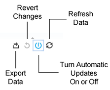

# Report Technology{#report-technology}

Describes the underlying software that powers the interactive reports and the data update schedule.

<!-- 

c_report_technology.xml

 -->

## Interactive Reports Use Tableau Technology

[!DNL Audience Manager] uses [Tableau](https://www.tableausoftware.com/) software to display data in the interactive reports. With [!DNL Tableau], the [!UICONTROL Delivery and Overlap] reports use visual cues and symbols that help you:

* Find high and low performance traits. 
* Spot traits and segments with low and high unique visitor overlap. 
* Use overlap data to build targeted segments. 
* Expand reach by identifying related traits with low overlap.

## Data Update Schedule

Report data is updated weekly each Sunday. The update processes data from Saturday (the day before) back to the previous Sunday. 

## Shapes, Colors, and Sizes Used in Interactive Reports {#shapes-colors-sizes}

Most of the interactive reports display results using shapes of different sizes and colors. This display format is designed to help you make sense of the data visually, without having to wade through rows and columns of numbers.

<!-- 

r_legend.xml

 -->

### Report Legend

The following table defines the shapes, sizes, and colors used in the dynamic reports.

<table id="table_EC180A96E3784FC6B81FCFB546C4A3FA"> 
 <thead> 
  <tr> 
   <th colname="col1" class="entry"> Data Element </th> 
   <th colname="col2" class="entry"> Description </th> 
  </tr> 
 </thead>
 <tbody> 
  <tr> 
   <td colname="col1"> <b>Shapes</b> </td> 
   <td colname="col2"> 
    <ul id="ul_076773ABD0BB4CE6834ACFA8B3D6AC2E"> 
     <li id="li_BBAB37A6EC1549B48C0E4D3BFAF7062C">Circles indicate your own first-party traits. </li> 
     <li id="li_371331AE984A4A999CE0596EA13987E0">Squares indicate third-party traits. </li> 
    </ul> </td> 
  </tr> 
  <tr> 
   <td colname="col1"> <b>Colors</b> </td> 
   <td colname="col2"> 
    <ul id="ul_F5D243297F0C4E5A8EDCBD28A548869E"> 
     <li id="li_332EB873A35440E6BB6093E36A0FAC3D">Red shades indicate <i>low</i> overlap. </li> 
     <li id="li_29DFDB1218DF4069B5DCFF841D48EF56">Green shades indicate <i>high</i> overlap. </li> 
    </ul> </td> 
  </tr> 
  <tr> 
   <td colname="col1"> <b>Size</b> </td> 
   <td colname="col2"> Size increases or decreases in direct proportion to reach (the number or % of clicks or unique users in a trait or segment). </td> 
  </tr> 
 </tbody> 
</table>

## Report Icons and Tools Explained {#icons-tools-explained}

Describes how to search and use the various icon-tools used in the dynamic reports.

<!-- 

r_icons.xml

 -->

### Data Icons and Tools

The following icons-tools are available at the bottom of each dynamic report window. The following illustration provides more information about these tools.

### Export Data

This tools lets you export data from the report in 4 different formats.  

|  Export Option  | Exports Data  |
|---|---|
| **[!UICONTROL Image]** | As an image (.png) file. Useful when you want to download and share report data in its original, graphical format.  |
| **[!UICONTROL PDF]** | As a PDF file.  |
| **[!UICONTROL Data]** | In a new browser window as numeric data in columns and rows.  |
| **[!UICONTROL Crosstab]** | As a .csv file.  |

### Revert Changes

Select this tool to undo any interactive click changes you may have performed on the report.

### Automatic Updates

The [!UICONTROL Delivery-Performance] and [!UICONTROL Trait-to-Trait Overlap] reports are dynamic reports that respond and change based on user click actions. 

For example, say you want to select several advertisers in the [!UICONTROL Overlap] report. When enabled, automatic updates will start to return data as soon as you select a checkbox. This dynamic behavior can interrupt your workflow because you have to wait until the report finishes processing before selecting another advertiser. Use this tool to turn that feature off (and on again) as required.

### Refresh Data

Click the refresh icon to run a report or reload your data set. When automatic updates are off, click refresh to run or update the report.

### Search

Search is represented by a generic magnifying glass icon (not shown). The search field is hidden until you click on the selection labels on the left side of the screen. The table below describes the location of the search tool for each report.  

|  Report  | To find search, hover over  |
|---|---|
| [!UICONTROL Delivery and Performance] report  | The "Advertiser Name" label.  |
| [!UICONTROL Overlap] reports  | The "SID Name" label.  |
