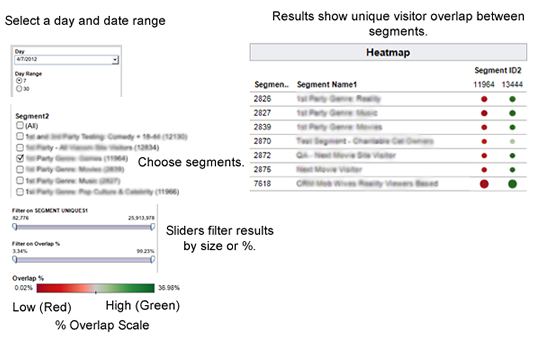

# Segment-to-Segment Overlap Report{#segment-to-segment-overlap-report}

Returns data on how many unique users are shared between your segments.

## Segment-to-Segment Overlap Report {#concept_25E40808056B451BA06502A9527A55AA}

Returns data on how many unique users are shared between your segments.

<!-- 

c_segment_segment_overlap.xml

 -->

### Overview

The [!UICONTROL Segment-to-Segment Overlap] report can help you:

* Identify segments with high or low overlap, depending on your needs. Traits with high overlap give you a targeted audience, but fewer unique visitors. Traits with low overlap can be useful to reach a larger, unique visitor set. 
* Find unexpected overlap and use that information to build new, high-performance segments.

### Sample Report

The following illustration provides a high-level overview of the [!UICONTROL Segment-to-Segment Overlap] report. 

>[!NOTE]
>
>The [!UICONTROL Segment-to-Segment Overlap] report returns an empty field when it compares the same segment to itself.

### Drill Down on Individual Data Points

Select an individual point to view data details in a pop up window. Your click actions automatically update data displayed in the report. 

## Segment-to-Segment Overlap Data Pop Fields Defined {#reference_8C44C0909B5E495FB374BF89581BCB63}

<!-- 

r_s2s_data_pop.xml

 -->

The popup for the [!UICONTROL Segment-to-Segment Overlap] report contains the metrics below. Note that the uniques metric in the table represents your *real-time users*.  

|  Metric  | Description  |
|---|---|
| **[!UICONTROL Segment ID1]** | Unique numeric ID for the segment that appears in the report results. Appears as the row ID for the segment.  |
| **[!UICONTROL Segment ID2]** | Unique numeric ID for the segment you select when running the report. Appears as the column ID for the segment.  |
| **[!UICONTROL Segment Name1]** | Name of the segment that appears in the report results row.  |
| **[!UICONTROL Segment Name2]** | Name of the segment you select when running the report. Appears in the report results column.  |
| **[!UICONTROL Overlap %]** | Shows the % of unique overlap between compared segments (overlap uniques/segment uniques 1).  |
| **[!UICONTROL Overlap Uniques]** | The number of unique visitors shared between compared segments.  |
| **[!UICONTROL Segment Uniques1]** | The number of unique visitors in segment 1. |
| **[!UICONTROL Segment Uniques2]** | The number of unique visitors in segment 2.  |

>[!MORE_LIKE_THIS]
>
>* [Filter Report Results With the Data Sliders](../../reporting/dynamic-reports/data-sliders.md#concept_00E60A0BDB274B07A1DD342EE5554C37)
>* [Shapes, Colors, and Sizes Used in Interactive Reports](../../reporting/dynamic-reports/interactive-report-technology.md#reference_25F1411379B34946B5AB8156A0F87626)
>* [Report Icons and Tools Explained](../../reporting/dynamic-reports/interactive-report-technology.md#reference_8D90E6C1F0AE46D4AC0911707395BED6)
>* [Overlap Reports: Update Schedule and Minimum Segment Size](../../reporting/dynamic-reports/overlap-minimum-segment-size.md#concept_6C439B845E684C40A726C546F9AF0AFD)
>* [Data Sampling and Error Rates in Selected Audience Manager Reports...](../../reporting/report-sampling.md#concept_624BB1069F8A4CBD948ABD87105329E4)
>* [CSV Files for Overlap Reports](../../reporting/dynamic-reports/overlap-csv-files.md#concept_440C76BFFAC74669972CE538F8B5040F)