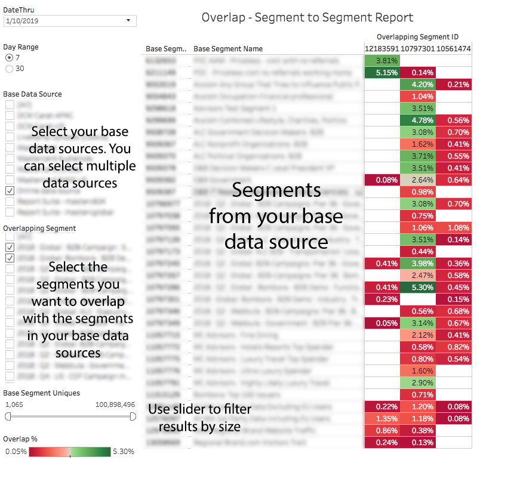

# Segment-to-Segment Overlap Report{#segment-to-segment-overlap-report}

Returns data on how many unique users are shared between your segments.

>[!NOTE]
>
>The Overlap reports in Audience Manager adhere to RBAC principles. You can only see segments from data sources that you have access to based on the [RBAC User Group](/help/using/features/administration/administration-overview.md) that you belong to.

<!-- 

c_segment_segment_overlap.xml

 -->

## Overview

The [!UICONTROL Segment-to-Segment Overlap] report can help you:

* Identify segments with high or low overlap, depending on your needs. Traits with high overlap give you a targeted audience, but fewer unique visitors. Traits with low overlap can be useful to reach a larger, unique visitor set.
* Find unexpected overlap and use that information to build new, high-performance segments.

## Sample Report

The following illustration provides a high-level overview of the [!UICONTROL Segment-to-Segment Overlap] report. 

>[!NOTE]
>
>The [!UICONTROL Segment-to-Segment Overlap] report returns an empty field when it compares the same segment to itself.

## Drill Down on Individual Data Points

Select an individual point to view data details in a pop up window. Your click actions automatically update data displayed in the report. 

## Segment-to-Segment Overlap Data Pop Fields Defined {#fields-defined}

<!-- 

r_s2s_data_pop.xml

 -->

The popup for the [!UICONTROL Segment-to-Segment Overlap] report contains the metrics below. Note that the uniques metric in the table represents your *real-time users*.  

|  Metric  | Description  |
|---|---|
| **[!UICONTROL Base Segment ID]** | Unique numeric ID for the segment that appears in the report results. Appears as the row ID for the segment.  |
| **[!UICONTROL Base Segment Name]** | Name of the segment that appears in the report results row.  |
| **[!UICONTROL Overlapping Segment ID]** | Unique numeric ID for the segment you select when running the report. Appears as the column ID for the segment.  |
| **[!UICONTROL Overlapping Segment Name]** | Name of the segment you select when running the report. Appears in the report results column.  |
| **[!UICONTROL Base Segment Uniques]** | The number of unique visitors in your base segment. |
| **[!UICONTROL Base Segment Uniques]** | The number of unique visitors in your overlapping segment.  |
| **[!UICONTROL Overlapping Uniques]** | The number of unique visitors shared between compared segments.  |
| **[!UICONTROL Overlap %]** | To get the overlap %, Audience Manager uses the following formula: Overlapping Uniques / (Base Segment Uniques + Overlapping Segment Uniques – Overlapping Uniques)|

>[!MORELIKETHIS]
>
>* [Filter Report Results With the Data Sliders](../../reporting/dynamic-reports/data-sliders.md)
>* [Shapes, Colors, and Sizes Used in Interactive Reports](../../reporting/dynamic-reports/interactive-report-technology.md#shapes-colors-sizes)
>* [Report Icons and Tools Explained](../../reporting/dynamic-reports/interactive-report-technology.md#icons-tools-explained)
>* [Overlap Reports: Update Schedule and Minimum Segment Size](../../reporting/dynamic-reports/overlap-minimum-segment-size.md)
>* [Data Sampling and Error Rates in Selected Audience Manager Reports...](../../reporting/report-sampling.md)
>* [CSV Files for Overlap Reports](../../reporting/dynamic-reports/overlap-csv-files.md)
