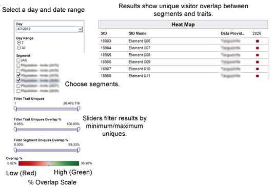
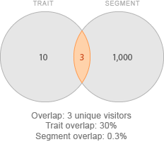

# Segment-to-Trait Overlap Report

Returns data on the number of unique users shared between a particular trait and an entire segment.

## Segment-to-Trait Overlap Report {#concept_36186B1ABEA34A6AAC7F5CF938A122B7}

Returns data on the number of unique users shared between a particular trait and an entire segment. 
<draft-comment otherprops="merge">
  c_segment_trait_overlap.xml 
</draft-comment>

**Overview** 

As an optimization tool, the [!UICONTROL Segment to Trait Overlap] reports helps you build highly focused segments or expand segment reach. For example, you can create focused segments and traits with high overlap to reach a particular audience. However, a lot of overlap may mean fewer unique users (less reach). Running this report to help expand reach by removing traits with a lot of segment overlap and replacing them with traits that have less overlap. 

**Sample Report** 

The following illustration provides a high-level overview of the [!UICONTROL Segment-to-Trait Overlap] report. 

 

**Drill Down on Individual Data Points** 

Select an individual point to view data details in a pop up window. Your click actions automatically update data displayed in the report. 
>[!MORE_LIKE_THIS]
>
>* [Filter Report Results With the Data Sliders](data-sliders.md#concept_00E60A0BDB274B07A1DD342EE5554C37)
>* [Shapes, Colors, and Sizes Used in Interactive Reports](interactive-report-technology.md#reference_25F1411379B34946B5AB8156A0F87626)
>* [Report Icons and Tools Explained](interactive-report-technology.md#reference_8D90E6C1F0AE46D4AC0911707395BED6)
>* [Overlap Reports: Update Schedule and Minimum Segment Size](overlap-minimum-segment-size.md#concept_6C439B845E684C40A726C546F9AF0AFD)
>* [Data Sampling and Error Rates in Selected Audience Manager Reports...](report-sampling.md#concept_624BB1069F8A4CBD948ABD87105329E4)
>* [CSV Files for Overlap Reports](overlap-csv-files.md#concept_440C76BFFAC74669972CE538F8B5040F)

## Comparing Segments to Traits {#concept_9E8FF2A83C194962991B129E783C23B2}

Describes how you can compare segments and traits to derive meaningful information from the results. 
<draft-comment otherprops="merge">
  c_compare_s2t.xml 
</draft-comment>

**Comparing Trait and Segment Uniques: An Example** 

At first glance, it may seem illogical to compare segments to traits and attempt to draw conclusions from the results. After all, segments and traits are different, so how can data derived from disparate items have meaning? However, in this case, we're not comparing traits and segments, but the number of unique visitors shared between them. The shared unique visitor count provides the common value that makes a segment to trait comparison possible. 

The following diagram illustrates the relationship between a trait and the segment it belongs to. In this case, we have a trait with 10 visitors and a segment with 1,000 visitors. They share 3 unique visitors in common. 

 

The unique visitor count is the common, constant value shared between these different classes of objects. As a result, you can determine the unique visitor relationship between them as follows: 
* The trait shares 30% of its unique visitors with the segment (3/10 = 0.30).
* The segment shares 0.3% of its unique visitors with the trait (3/1,000 = 0.003)

**Find Value in Segment to Trait Comparisons** 

Looking at the overlap between traits and segments can help you estimate the total available visitor pool (forecasting) or find inefficient segments with too much overlap. 

<table id="table_5B211EF95216426299EB20253A5A9C1B"> 
 <thead> 
  <tr> 
   <th colname="col1" class="entry"> Use Case </th> 
   <th colname="col2" class="entry"> Description </th> 
  </tr>
 </thead>
 <tbody> 
  <tr> 
   <td colname="col1"><b>Forecasting</b> </td> 
   <td colname="col2"> 
To determine the available visitor pool, sum the difference between the trait total (less overlap) and the segment total (less overlap). 
 
This segment-trait combination could reach up to 1004 new users. 
 </td> 
  </tr> 
  <tr> 
   <td colname="col1"><b>Find Inefficient Segments</b> </td> 
   <td colname="col2"> 
If a trait is part of an  AND group in a segment definition, the unique visitors who have that trait are already in the segment and not available for adding to the segment. You can use this report to find relevant traits with low overlap and add them to the segment definition, therefore increasing the reach of that segment audience pool. 
 </td> 
  </tr> 
 </tbody> 
</table>

## Understanding the Data Filters in the Segment-to-Trait Overlap Report {#reference_38D7AB743DC346AC8588BA85DA92C754}

Describes how the trait and segment unique overlap % sliders work. 
<draft-comment otherprops="merge">
  r_s2t_sliders.xml 
</draft-comment>

>
>
>The [!UICONTROL Segment-to-Trait overlap] report lets you use two sliders to filter data by the overlap % by trait or segment. 
>
>* **[!UICONTROL Filter Trait Uniques %:]** Filters data by the % of unique visitors shared between the trait and the segment.>
>* **[!UICONTROL Filter Segment Uniques Overlap %:]** Filters data by the % of unique visitors share between the segment and the trait.>
>
>
>
>
>**Example** 
>
>
>The following diagram illustrates the difference between the trait uniques % and the segment uniques %. In this case, the trait and segment share 3 unique visitors. As proportions: >
>* The trait shares 30% of its unique visitors with the segment (3/10 = 0.30).>
>* The segment shares 0.3% of its unique visitors with the trait (3/1,000 = 0.003)>
>
>

>
>
> 
>[!MORE_LIKE_THIS]
>
>* [Filter Report Results With the Data Sliders](data-sliders.md#concept_00E60A0BDB274B07A1DD342EE5554C37)

## Segment-to-Trait Data Pop Fields Defined {#reference_674BE59D7C6B45C6B653233F69CFC656}

Describes the metrics displayed in the popup window when you click an individual data point. 
<draft-comment otherprops="merge">
  r_s2t_data_pop.xml 
</draft-comment>

>
>
>The popup for the [!UICONTROL Segment-to-Trait Overlap] report contains the following metrics: 
>
>
><table id="table_4AF72754276242FFB11543635B43AD90"> 
 <thead> 
  <tr> 
   <th colname="col1" class="entry"> Metric </th> 
   <th colname="col2" class="entry"> Description </th> 
  </tr>
 </thead>
 <tbody> 
  <tr> 
   <td colname="col1"><b> Segment ID</b> </td> 
   <td colname="col2"> Unique numeric ID for the segment. </td> 
  </tr> 
  <tr> 
   <td colname="col1"><b> Data Provider Name</b> </td> 
   <td colname="col2"> Name of the segment owner. </td> 
  </tr> 
  <tr> 
   <td colname="col1"><b> Data Provider Type</b> </td> 
   <td colname="col2">Defines the type of provider a trait belongs to. Can be either: 
    <ul id="ul_0477C04A33FD4F5D998B98984E6554D3"> 
     <li id="li_50FCA48EDB5843AB8FB6C34ED2C0067D">First-party (your own trait). </li> 
     <li id="li_4F6148EDAEFE43FA8D505944E9FE3855">Third-party (from an outside data partner/vendor). </li> 
    </ul> </td> 
  </tr> 
  <tr> 
   <td colname="col1"><b> SID</b> </td> 
   <td colname="col2"> Unique numeric ID for the segment. </td> 
  </tr> 
  <tr> 
   <td colname="col1"><b> SID Name</b> </td> 
   <td colname="col2"> Name of the segment. </td> 
  </tr> 
  <tr> 
   <td colname="col1"><b> Trait Uniques Overlap %</b> </td> 
   <td colname="col2"> % of unique visitors a trait shares with the segment. </td> 
  </tr> 
  <tr> 
   <td colname="col1"><b> Segment Uniques Overlap %</b> </td> 
   <td colname="col2"> % of unique visitors a segment shares with a trait. </td> 
  </tr> 
  <tr> 
   <td colname="col1"><b> Overlap Uniques</b> </td> 
   <td colname="col2"> Number of unique visitors shared between the segment and the trait. </td> 
  </tr> 
  <tr> 
   <td colname="col1"><b> Segment Uniques</b> </td> 
   <td colname="col2"> Number of unique visitors in the segment. </td> 
  </tr> 
  <tr> 
   <td colname="col1"><b> Trait Uniques</b> </td> 
   <td colname="col2"> Number of unique visitors in the trait. </td> 
  </tr> 
 </tbody> 
</table>>
>
