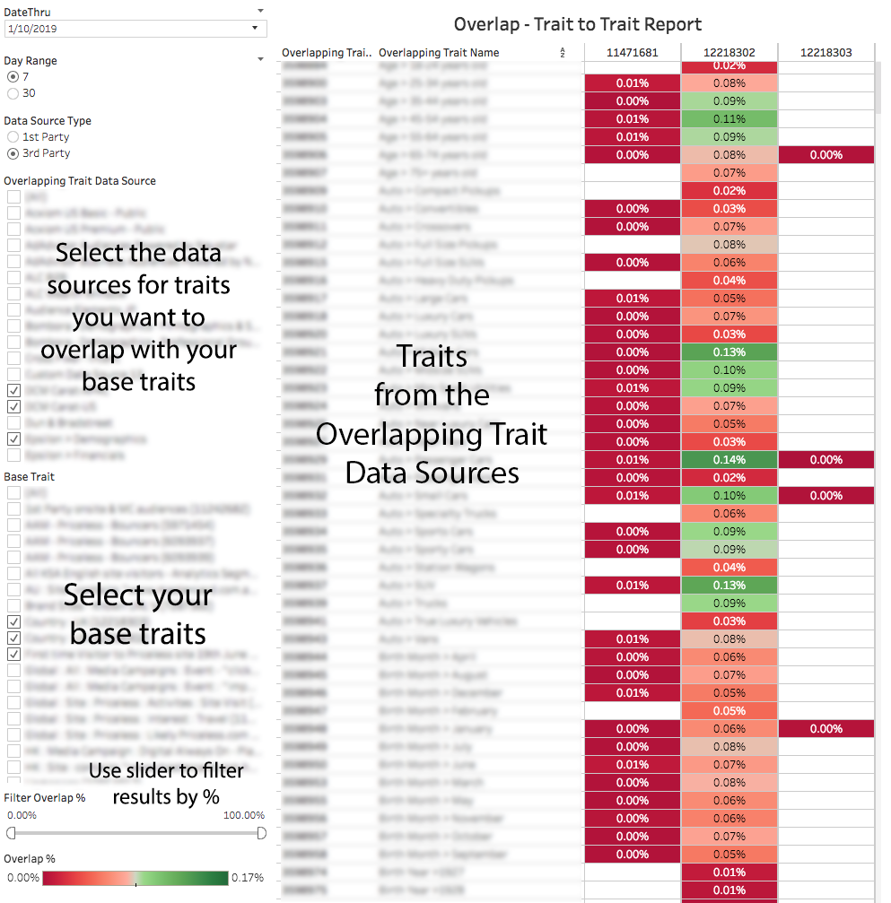

# Trait-to-Trait Overlap Report{#trait-to-trait-overlap-report}

Returns data on the number of unique users shared among all your first and third-party traits.

>[!NOTE]
>
>The Overlap reports in Audience Manager adhere to RBAC principles. You can only see traits from data sources that you have access to based on the [RBAC User Group](/help/using/features/administration/administration-overview.md) that you belong to.

<!-- 

c_overlap_reports.xml

 -->

## Overview

The [!UICONTROL Trait-to-Trait Overlap] report returns data on the % of unique users shared between all your own traits and your third-party traits. As an optimization tool, this report helps you:

* Create segments with high or low overlap, depending on your needs. Traits with high overlap give you a targeted audience, but fewer unique visitors. Traits with low overlap can be useful to reach a larger, unique visitor set. 
* Validate third-party trait data: Strong overlap between similar first and third-party traits suggests that the trait from your data partner is accurate and trustworthy. Conversely, low overlap can indicate that a third-party trait may not actually contain the same information as your own, similar first-party trait. 
* Find unexpected overlap between traits and use that information to build innovative segments.

## Sample Report

The following illustration provides a high-level overview of elements in the [!UICONTROL Trait-to-Trait Overlap] report. 

>[!NOTE]
>
>The [!UICONTROL Trait-to-Trait Overlap] report returns an empty field when it compares the same trait to itself.

>[!NOTE]
>
>Folder traits are not available for comparison within trait-to-trait overlap reports. By creating a segment utilizing a particular folder trait, you can perform analysis via the [segment-to-segment overlap](help/using/reporting/dynamic-reports/segment-trait-overlap-report.md) report.

## Drill Down on Individual Data Points

Select an individual point to view data details in a pop up window. Your click actions automatically update data displayed in the report. 

## Trait-to-Trait Overlap Data Pop Fields Defined {#field-definitions}

Describes the metrics displayed in the popup window when you click an individual data point.

<!-- 

r_t2t_data_pop.xml

 -->

The popup for the [!UICONTROL Trait-to-Trait Overlap] report contains the metrics below. Note that the uniques metric in the table represents your *real-time users*.  

<table id="table_A2A0CFC47C1A404994B82E6630E711A2"> 
 <thead> 
  <tr> 
   <th colname="col1" class="entry"> Metric </th> 
   <th colname="col2" class="entry"> Description </th> 
  </tr>
 </thead>
 <tbody> 
  <tr> 
   <td colname="col1"><b> Overlap %</b> </td> 
   <td colname="col2"> Shows the % of unique overlap between compared traits (overlap uniques/trait uniques). </td> 
  </tr> 
  <tr> 
   <td colname="col1"><b> Data Source Type</b> </td> 
   <td colname="col2">Defines the type of data source a trait belongs to. Can be either: 
    <ul id="ul_0477C04A33FD4F5D998B98984E6554D3"> 
     <li id="li_50FCA48EDB5843AB8FB6C34ED2C0067D">First-party (your own trait). </li> 
     <li id="li_4F6148EDAEFE43FA8D505944E9FE3855">Third-party (from an outside data partner/vendor). </li> 
    </ul> </td> 
  </tr> 
  <tr> 
   <td colname="col1"><b> Overlapping Trait ID</b> </td> 
   <td colname="col2"> Unique numeric ID for the overlapping trait. </td> 
  </tr> 
  <tr> 
   <td colname="col1"><b> Overlapping Trait Name</b> </td> 
   <td colname="col2"> Name of the overlapping trait. </td> 
  </tr>
    <tr> 
   <td colname="col1"><b> Trait ID 2</b> </td> 
   <td colname="col2"> Unique numeric ID for the trait in your base data source. </td> 
  </tr> 
  <tr> 
   <td colname="col1"><b> Trait Name 2</b> </td> 
   <td colname="col2"> Name of the trait in your base data source. </td> 
  </tr> 
  <tr> 
   <td colname="col1"><b> Overlap Uniques</b> </td> 
   <td colname="col2"> 
To get the overlap %, Audience Manager uses the following formula:
 
Overlapping Uniques / (Base trait Uniques + Overlapping trait Uniques – Overlapping Uniques)
 </td> 
  </tr> 
  <tr> 
   <td colname="col1"><b> Overlapping Trait Uniques</b> </td> 
   <td colname="col2"> The number of unique visitors from the overlapping trait. </td> 
  </tr> 
    <tr> 
   <td colname="col1"><b> Base Trait Uniques</b> </td> 
   <td colname="col2"> The number of unique visitors from the base trait. </td> 
  </tr> 
 </tbody> 
</table>

>[!MORELIKETHIS]
>
>* [Filter Report Results With the Data Sliders](../../reporting/dynamic-reports/data-sliders.md)
>* [Shapes, Colors, and Sizes Used in Dynamic Reports](../../reporting/dynamic-reports/interactive-report-technology.md#shapes-colors-sizes)
>* [Report Icons and Tools Explained](../../reporting/dynamic-reports/interactive-report-technology.md#icons-tools-explained)
>* [Overlap Reports: Update Schedule and Minimum Segment Size](../../reporting/dynamic-reports/overlap-minimum-segment-size.md)
>* [Data Sampling and Error Rates in Selected Audience Manager Reports...](../../reporting/report-sampling.md)
>* [CSV Files for Overlap Reports](../../reporting/dynamic-reports/overlap-csv-files.md)
