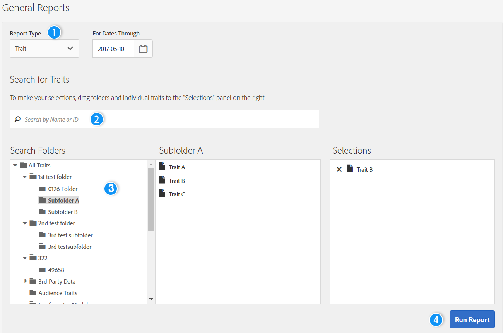
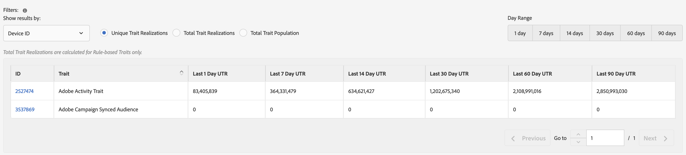
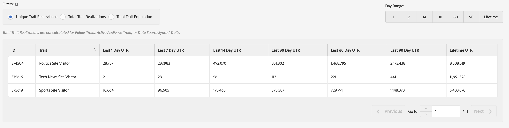
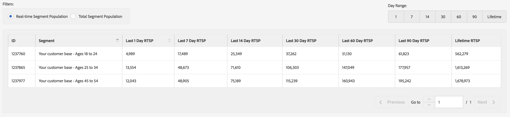
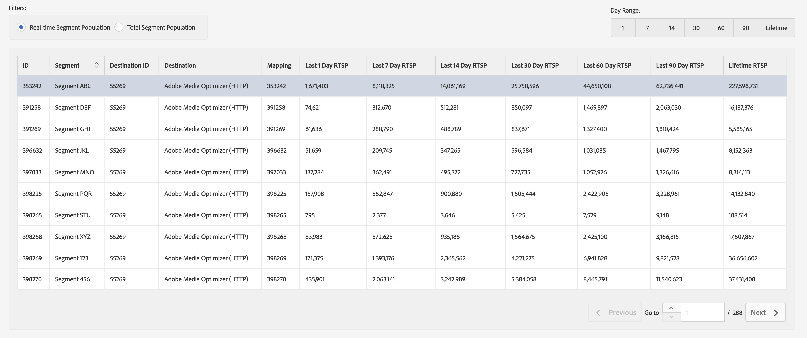

# General Reports{#general-reports}

A [!UICONTROL General] report returns performance data on traits, segments, and destinations.

## Overview {#general-reports-overview}

<!-- 

c_general_reports.xml

 -->

[!DNL Audience Manager] uses [!UICONTROL Role Based Access Control] ([!UICONTROL RBAC]) to extend user-group permissions to the [!UICONTROL General] reports. Users can see only those traits and segments in reporting that they have permissions to view. [!UICONTROL RBAC] functionality lets you control what reporting data internal teams are able to view. For example, an agency that manages different advertiser accounts can configure user-group permissions so that a team that manages Advertiser A's account cannot see Advertiser B's reporting data.

Run a [!UICONTROL General] report when you need to:

* Review performance by trait, segment, or destination.
* Track impressions (total and unique) at 1, 7, 14, 30, 60, and 90 day intervals. 
* Review total and unique load counts.
* Compare trait and segment performance.
* Identify strong or poor performance traits and segments, analyze demand, or compare load/fire data with third-party reports. 
* Export data (.csv format) for further analysis and sharing.

The following illustration provides a high-level overview of key elements in the [!UICONTROL General] report.

1. Configure the following options:

   * **Report Type:** Select the desired report type (Trait, Segment, or Destination).

   * **For Dates Through:** Specify the date range for the report.

2. Search for a trait, segment, or destination by name or ID.
3. From the folder list, drag and drop the traits, segments, or destinations you want to report to the [!UICONTROL Selections] panel on the right side.
4. Generate the report to display in an exportable table.

## Run a General Report {#run-general-report}

This section describes how to run a [!UICONTROL General] report and set time and other performance options. 

<!-- 

t_run_general_report.xml

 -->

1. In the **[!UICONTROL Analytics]** dashboard, click **[!UICONTROL General Reports]**.
1. From the **[!UICONTROL Report Type]** drop-down list, select the desired type: Trait, Segment, or Destination.
1. *Conditional* Click the date box to display a calendar, then select the ending date for your report if you want to specify a date other than today.
1. Search for a trait, segment, or destination by name or ID.
1. From the folder list, drag and drop the traits, segments, or destinations you want to report to the [!UICONTROL Selections] panel on the right side.
1. Click **[!UICONTROL Run Report]**.

   Results display in an exportable table. Click the column headers to sort the results in ascending or descending order. 
1. Select the desired option button at the top of the report to filter data by performance ( [!UICONTROL Unique Trait Realizations], [!UICONTROL Total Trait Realizations], or [!UICONTROL Total Trait Population]) or by time (1, 7, 14, 30, 60, or 90 day range).

   >[!NOTE]
   >
   >[!UICONTROL Total Trait Realizations] are calculated for [!UICONTROL Rule-based Traits] only.

1. *Optional* Click **[!UICONTROL Export to CSV]**. This exports the [!UICONTROL Unique Trait Realizations], [!UICONTROL Total Trait Realizations], and [!UICONTROL Total Trait Population] for all day ranges.

## General Reports Results Explained {#general-reports-explained}

The numbers in the [!UICONTROL General Reports] are generated directly from our [!UICONTROL User Profile Store]. The results reflect the number of users that [!DNL Audience Manager] contained in the backend at the time these reporting numbers were generated.

* These numbers do not include visitor IDs with excessive traffic. Traffic from bots is filtered prior to reaching our backend system. Also, some bot traffic is discarded during a weekly cleanup job run in the backend.
* If you onboard data via inbound processing keyed off the [!DNL Audience Manager] UUID, and these IDs include users that are no longer active in our system, these inactive [!DNL Audience Manager] UUIDs never reach the [!UICONTROL User Profile Store] and are not reported.
* [!UICONTROL Total Trait Realizations] are calculated for [!UICONTROL Rule-based Traits] only.

## General Reports Results for Traits {#general-report-results-traits}

The filters below are available when you run a General report and select **[!UICONTROL Trait]** as the report type.

When filtering the results by [!UICONTROL Device ID]:

* [!UICONTROL Unique Trait Realizations] is the number of your anonymous device visitors that have added the trait to their profile within the selected time range.
* [!UICONTROL Total Trait Realization] is the total number of anonymouse trait realizations within the selected time range.
* [!UICONTROL Total Trait Population] is the number of your anonymous device visitors that have this trait on their profile.

When filtering the results by [!UICONTROL Cross-Device ID]:

* [!UICONTROL Unique Trait Realizations] is the number of your authenticated visitors that have added the trait to their profile, within the selected time range.
* [!UICONTROL Total Trait Realization] is the total number of authenticated trait realizations within the selected time range.
* [!UICONTROL Total Trait Population] is the number of your authenticated visitors that have this trait on their profile.

<!-- 
### Unique Trait Realizations

This metric represents the unique number of [Audience Manager Unique User IDs (UUID)](../reference/ids-in-aam.md) that qualified for the trait in your selected time range. For example, if a user visited your homepage three times on 10/1, you would see one Unique Trait Realization.

### Total Trait Realizations

This metric represents the total amount of trait fires for the trait in your selected time range. For example, if a user visited your homepage, then navigated to your tech news and your sports news sections, they would appear in the General Report as three total trait realizations, and one unique trait realization.

### Total Trait Population

This metric represents the total amount of Audience Manager UUIDs that are currently qualified for the trait. Use this number to understand the total amount of users you could use for segmentation and targeting. Typically, users remain part of a trait for [120 days](../features/traits/create-onboarded-rule-based-traits.md#set-expiration-interval). For example, a user visiting your homepage three times today and never returning afterwards, would remain as a user in this population every day until 120 days from now. At the 120 day mark, they would be removed from the population. Read our [Trait and Segment Qualification Reference](../features/traits/trait-and-segment-qualification-reference.md) for more examples on the difference between Unique Trait Realizations and Total Trait Population.

The illustration below shows the results of running a general report for the Trait report type. -->
<!-- 
 -->

## General Reports Results for Segments {#general-report-results-segments}

The metrics below are available when you run a General report and select **[!UICONTROL Segment]** as the report type:

### Real-time Segment Population

This metric represents the actual number of unique visitors seen in real-time for the specified time range and who were qualified for the segment at the moment they were seen by Audience Manager.

### Total Segment Population

This metric represents the total number of Audience Manager UUIDs that are qualified for the segment within the look-back period you selected. Your 1 day Total Segment Population represents your most accurate user base for targeting.

>[!NOTE]
>
>Select **[!UICONTROL Include Destination Mappings]** to see a breakdown of segment population for activated destinations.

The illustration below shows the results of running a general report for the Segment report type.

## General Reports Results for Destinations {#general-report-results-destinations}

The metrics below are available when you run a General report and select **[!UICONTROL Destination]** as the report type:

**Real-time Segment Population**

This metric represents the actual number of unique visitors seen in real-time for the specified time range and who were qualified for the segment at the moment they were seen by Audience Manager.

**Total Segment Population**

This metric represents the total number of Audience Manager UUIDs belonging to a segment within the look-back period, that were sent to a destination.

The illustration below shows the results of running a general report for the Destinations report type.

