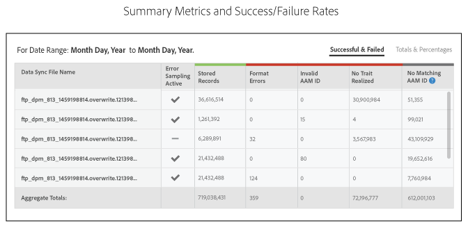
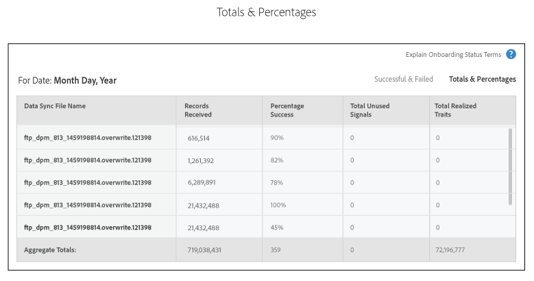
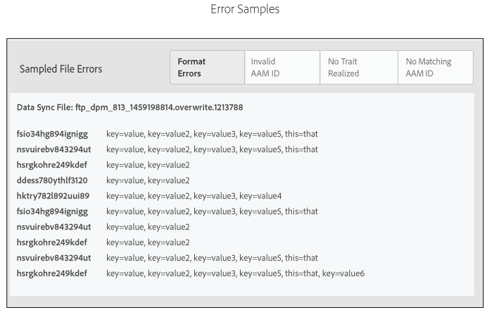

# Onboarding Status Report: About{#onboarding-status-report-about}

The Onboarding Status Report checks success and failure rates for processing records in your inbound data source files. This report displays data in an interactive bar chart and provides summary metrics in tabular form. And, it includes an option that samples files for a fixed time interval and displays the most common errors for each error type. You can find this report in Analytics > Onboarding Status Report. This report is also available when you create an inbound data source.

## Onboarding Status Report: About {#onboarding-status-about}

The [!UICONTROL Onboarding Status Report] checks success and failure rates for processing records in your inbound data source files. This report displays data in an interactive bar chart and provides summary metrics in tabular form. And, it includes an option that samples files for a fixed time interval and displays the most common errors for each error type. You can find this report in **[!UICONTROL Analytics > Onboarding Status Report]**. This report is also available when you create an inbound data source.

## Error Reporting and Error Sampling {#error-reporting-sampling}

Error reporting and error sampling are 2 separate features of the [!UICONTROL Onboarding Status] report.

<table id="table_4706D891D4C545E8BF9D8A0CC052CC48"> 
 <thead> 
  <tr> 
   <th colname="col1" class="entry"> Feature </th> 
   <th colname="col2" class="entry"> Description </th> 
  </tr> 
 </thead>
 <tbody> 
  <tr> 
   <td colname="col1"> 
 <b>Error Reporting</b> 
 </td>
   <td colname="col2"> 
Error reporting shows you the success and failure rates for the number of records processed in an inbound data source. It returns data in an interactive, stacked bar graph and as summary metrics in tables below the graph. 
 
Error reporting is automatic. It runs continuously for all of your inbound data sources. It returns data based on range of preset time intervals or a customized time interval that you set with a calendar widget. 
 </td> 
  </tr> 
  <tr> 
   <td colname="col1"> 
 <b>Error Sampling</b> 
 </td>
   <td colname="col2"> 
Error sampling parses the contents of your data files and returns the 10 most common errors for each error type. The errors in your inbound data files prevent individual records from being processed. Use this report as a troubleshooting tool to help reduce the number of file errors and improve processing rates. 
 
You must activate error sampling manually. It runs for 14-days from the day of activation and then turns itself off. You can turn error sampling back on after the 14-day interval expires. You activate error sampling when you <a href="../features/manage-datasources.md#concept_3B7696B3EC77416492D3B99EBD79EA44"> create an inbound data source</a> or by checking the  Error Sampling check box from the  Data Source Settings section of an existing inbound data source. 
 
Error sampling is a computationally demanding process. As a result, it only returns first 10 errors for each error category. It is not designed to return every error contained in an inbound data source. These errors are a representative sample of a potentially larger group of similar errors. Review your entire file for the types of errors this report flags, reformat the file, and send it in again. 
 
See <a href="../integration/sending-audience-data/batch-data-transfer-explained/inbound-file-contents.md"> Inbound Data File Contents: Syntax, Variables, and Examples</a> for more information about how to properly format an data file for an inbound data source. 
 </td> 
  </tr> 
 </tbody> 
</table>

## Error Report Bar Chart {#error-report-bar-chart}

The error report graphs the success and failure rates for record processing in a stacked bar graph as shown in the following example. The graph is interactive. Clicking on a bar shows summary metrics for that day in a table below the graph.

## Error Report Tables {#error-report-tables}

The error report displays tabular data below the bar graph. The table shows success and failure rates along with totals and percentages.

**Successful and Failed Records**

This default view shows you a frequency count of the total records in your report and includes a breakdown of the errors by error type.

**Totals & Percentages**

Click **[!UICONTROL Totals & Percentages]** to see what % of your files were processed successfully.

## Error Sampling Report for 14 Days {#error-reporting-14-days}

With error sampling active, the report will show you the top 10 errors for each error type. Click on an error type button at the top of the report to see each set of sampled data.

>[!NOTE]
>
>The report does not highlight record errors with this current release. To find and fix file errors, you should review the results and compare those to the specifications in the [Inbound Data File Contents](../integration/sending-audience-data/batch-data-transfer-explained/inbound-file-contents.md) documentation.

## Receive E-mail Notifications {#receive-email-notifications}

You can add the e-mail addresses of recipients that you want to be notified of the uploaded inbound files' status. Note that you can select different recipients for different data sources.

## Create an Onboarding Status Report {#create-onboard-status-report}

A [!UICONTROL Sample Error Report] returns the number records in a data source were processed successfully and how many failed. Follow these steps to generate a [!UICONTROL Sample Error Report].

<!-- 

create-onboarding-status-report.xml

 -->

1. Go to **[!UICONTROL Analytics > Onboarding Status Report]**. Search for a data source or choose one from the list.

1. Select a date range. Options include:

    * A set of fixed report intervals. 
    * Calendar widgets that let you create a custom date range.

1. Click **[!UICONTROL OK]**.

## Onboarding Status Report Terms and Definitions {#report-terms-conditions}

A reference guide for the labels and terms used in this report.

<table id="table_1D44A2E6B4C847848B818190DD336841"> 
 <thead> 
  <tr> 
   <th colname="col1" class="entry"> Term </th> 
   <th colname="col2" class="entry"> Definition </th> 
  </tr> 
 </thead>
 <tbody> 
  <tr> 
   <td colname="col1"> 
 <b>Data Sync File Name</b> 
 </td> 
   <td colname="col2"> 
Lists files that  Audience Manager received and processed from you selected inbound data source. 
 
File processing will fail if the file name is formatted improperly. File name requirements vary depending on how you send this data to  Audience Manager. Delivery methods include  Amazon S3 and FTP. For instructions on how to name your files, see: 
 
 
     <ul id="ul_9A32906A14CA41C5AED0E13930DB31BA"> 
      <li id="li_A5A0E6ED711D4002B52092619F87C7D6"> <a href="../integration/sending-audience-data/batch-data-transfer-explained/inbound-s3-filenames.md#concept_B3CAF442BFFE4823B76A5D0D91DF9942"> Amazon S3 Name Requirements for Inbound Data Files </a> </li> 
      <li id="li_9590241AEC0C482D91C64DB760B32B0D"> <a href="../integration/sending-audience-data/batch-data-transfer-explained/inbound-ftp-filenames.md#concept_D34898442363415DBF75CEBFC2E86997"> FTP Name Requirements for Inbound Data Files </a> </li> 
     </ul> 
 </td> 
  </tr> 
  <tr> 
   <td colname="col1"> 
 <b>Format Errors</b> 
 </td> 
   <td colname="col2"> 
Lists the number of records that failed processing because they did not match the syntax or formatting requirements. See <a href="../integration/sending-audience-data/batch-data-transfer-explained/inbound-file-contents.md"> Inbound Data File Contents: Syntax, Variables, and Examples</a> for information on how to format your data. 
 </td> 
  </tr> 
  <tr> 
   <td colname="col1"> 
 <b>Invalid AAM ID</b> 
 </td> 
   <td colname="col2"> 
Lists the number of improperly formatted  Audience Manager user IDs (UUID). Usually, this indicates the IDs: 
 
    <ul id="ul_8304250E8F0F44918A50CF9D8D8D1F83"> 
     <li id="li_B100B4C2623B4E099E022869A4978357">Did not match the expected 38-digit format. </li> 
     <li id="li_44E8A9AD13174A20A5742E56ED786634">Contain alphabetical characters. IDs should be numbers only. </li> 
    </ul> </td> 
  </tr>

<tr> 
   <td colname="col1"> 
 <b>Invalid Device ID</b> 
 </td> 
   <td colname="col2"> 
Lists the number of improperly formatted Global Device IDs. See <a href="../reference/ids-in-aam.md">Index of IDs in Audience Manager</a> and <a href="../features/global-data-sources.md">Global Data Sources</a>  for details on how device IDs should be formatted and what global data sources you should use, based on the device type.

  
The error sampling section of the report includes detailed information about the invalid device IDs, such as:

   <ul>
    <li>The data source ID corresponding to the invalid device ID;</li>
    <li>The invalid device ID;</li>
    <li>The type of expected device ID, based on the data source.</li>
   </ul>
  </tr>

  <tr> 
   <td colname="col1"> 
 <b>No Matching AAM ID</b> 
 </td> 
   <td colname="col2"> 
These are onboarded IDs  Audience Manager cannot match to an existing ID. Onboarded IDs can have this status when  Audience Manager has not yet performed an ID sync or it still can't match the ID even after a synch. 
 
In the case of unmatched mobile IDs,  Audience Manager will: 
 
    <ul id="ul_B0D6AF9EB27D4017B35E36824B403879"> 
     <li id="li_D141000A50D3463182CBA4571DCC5373">Continue to store and try to synch this ID. </li> 
     <li id="li_2EFCEE716F254ABCBC5FBF749B7564E6">Record it as a  Stored Record in the report if the ID cannot be synched. </li> 
    </ul> 
If your onboarded file contains mobile IDs, then you can treat these numbers a bit more lightly than the other metrics. They will not affect the success and match rates for subsequent files. 
 </td> 
  </tr> 
  <tr> 
   <td colname="col1"> 
 <b>No Trait Realized</b> 
 </td> 
   <td colname="col2"> 
Lists traits that  Audience Manager cannot match to an onboarded trait. This could be the result of: 
 
    <ul id="ul_43619035AB6641B6949302FB50BDB5B1"> 
     <li id="li_D4C6306BF2B143198108702B309CE8CF">Improperly formatted traits in your inbound data file. For on how to format your data file, see <a href="../integration/sending-audience-data/batch-data-transfer-explained/inbound-file-contents.md"> Inbound Data File Contents: Syntax, Variables, and Examples</a>. </li> 
     <li id="li_A1C708A007D24EE09B7C629AFC6E43C3">Traits that have not yet been defined in  Audience Manager. </li> 
    </ul> </td> 
  </tr> 
  <tr> 
   <td colname="col1"> 
 <b>Percent Success</b> 
 </td> 
   <td colname="col2"> 
The percentage of records in your file that were stored successfully. Percent success = records processed / number of records in a file. 
 </td> 
  </tr> 
  <tr> 
   <td colname="col1"> 
 <b>Records Received</b> 
 </td> 
   <td colname="col2"> 
The total number of records received. In most cases, this number should match the total number of records (lines) in your inbound data file. 
 </td> 
  </tr> 
  <tr> 
   <td colname="col1"> 
 <b>Stored Records</b> 
 </td> 
   <td colname="col2"> 
Number of records stored successfully. Because of file format errors, some of the records received may not be stored by  Audience Manager. The number of stored records can be less than the number of records received. 
 </td> 
  </tr> 
  <tr> 
   <td colname="col1"> 
 <b>Total Realized Traits</b> 
 </td> 
   <td colname="col2"> 
The number of traits for all users across all inbound files that get stored in the  Audience Manager platform. 
 </td> 
  </tr> 
  <tr> 
   <td colname="col1"> 
 <b>Total Unused Signals</b> 
 </td> 
   <td colname="col2"> 
Total number of unused signals received in the report. This total is based on the total number of successfully stored records. 
 
See <a href="../reporting/dynamic-reports/unused-signals.md#concept_D3A6A3AD84AE47589699A13A8F971BE0"> Unused Signals Report</a> for more information. 
 </td> 
  </tr> 
 </tbody> 
</table>
