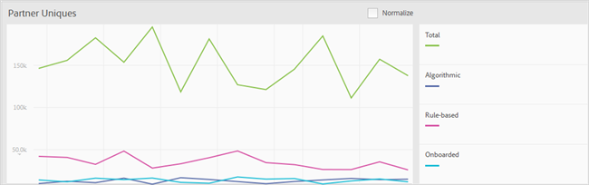
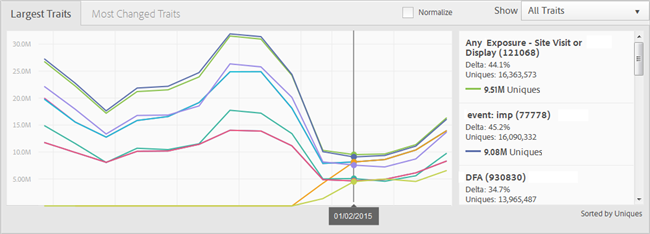

# Reports Dashboard{#reports-dashboard}

Use the Dashboard to view information about your unique visitor counts broken down by trait types and segments, for a specified time frame.

<!-- 

c_dashboard.xml

 -->

[!DNL Audience Manager] uses [!UICONTROL Role Based Access Control] ( [!UICONTROL RBAC]) to extend user-group permissions to the [!UICONTROL Dashboard]. Users can see only information on the dashboard that they have permissions to view. [!UICONTROL RBAC] functionality lets you control what reporting data internal teams are able to view. For example, an agency that manages different advertiser accounts can configure user-group permissions so that a team that manages Advertiser A's account cannot see Advertiser B's reporting data.

This dashboard can be used to troubleshoot data-delivery issues. For example, if you notice a dip or spike in total unique users with the breakdown of type of unique user (rule-based vs. onboarded), you have a better starting point to track down a potential data-delivery problem. If you notice a dip in total unique users and in onboarded unique users, you can go to the [!UICONTROL Onboarding Status] report to see if there was an issue with an inbound file.

**To access the Dashboard:**

1. In the top navigation menu, click **[!UICONTROL Dashboard]**. 
2. (Optional) Select the desired time frame from the last reporting date from the drop-down list (7 Days, 14 Days (the default), 30 Day, or 60 Days).

   Depending on the period selected, the delta change in the [!UICONTROL Largest Traits]/ [!UICONTROL Most Changed Traits] and [!UICONTROL Largest Segments]/ [!UICONTROL Most Changed Segments] panels displays the change in unique visitors in the audience over the period ending today vs. the prior period of the same length. For example, if you select 7 Days, the delta compares the unique visitors over the prior seven days ending today against the unique visitors for the seven days ending seven days ago.

   >[!NOTE]
   >
   >You can investigate a delta change that seems out of the ordinary by running a [!UICONTROL Trend] report. For example, if you see an unusually large delta change during the last seven days, you could run a [!UICONTROL Trend] report for the last 14 days (2 x 7) to better understand the numbers.

   Depending on the logged-in user's permissions, the following panels display:

    * [Partner Uniques](../reporting/reports-dashboard.md#section_E3B46BB8073747539F76AD75B5A5430E) 
    * [Largest Traits/Most Changed Traits](../reporting/reports-dashboard.md#section_E8970FD9FEF44C43A921D313698C843E) 
    * [Largest Segments/Most Changed Segments](../reporting/reports-dashboard.md#section_7AADC2775D9B46F69F84218CA535D287)

3. (Optional) Click **[!UICONTROL Normalize]** above any graph to show all of the data on the same scale. You can also mouse over any data point to see more information.

## Partner Uniques {#section_E3B46BB8073747539F76AD75B5A5430E}

Permission Required to View: [!UICONTROL View All Traits].

This panel displays the number of unique visitors during the specified time frame. Individual, color-coded lines represent the total number of unique visitors and the number of unique visitors captured using algorithmic, rule-based, and onboarded traits.

>[!NOTE]
>
>The total number of unique visitors represents visitors captured via rule-based or onboarded traits. However, the total number of unique visitors does not equal the sum of unique visitors captured using the rule-based and onboarded traits. The same unique user might be represented in either of these two trait types.

## Largest Traits/Most Changed Traits {#section_E8970FD9FEF44C43A921D313698C843E}

Permission Required to View: [!UICONTROL View Traits].

This panel displays the number of unique visitors captured by various traits.

Use the **[!UICONTROL Show]** drop-down list to display information about different types of traits: [!UICONTROL All Traits], [!UICONTROL Algorithmic], [!UICONTROL Onboarded], or [!UICONTROL Rule-Based].

This panel contains the following tabs: 

<table id="table_DA48BDEB4E0143BEA4EB85AC26FF6AE3"> 
 <thead> 
  <tr> 
   <th colname="col1" class="entry"> Tab </th> 
   <th colname="col2" class="entry"> Description </th> 
  </tr> 
 </thead>
 <tbody> 
  <tr> 
   <td colname="col1"> 
 Largest Traits 
 </td> 
   <td colname="col2"> 
Displays information about the number of unique visitors sorted by number (highest to lowest) and also lists the delta change of unique visitors during the specified time frame. 
 </td> 
  </tr> 
  <tr> 
   <td colname="col1"> 
 Most Changed Traits 
 </td> 
   <td colname="col2"> 
Displays information about the number of unique visitors sorted by the delta change. 
 </td> 
  </tr> 
 </tbody> 
</table>

## Largest Segments/Most Changed Segments {#section_7AADC2775D9B46F69F84218CA535D287}

Permission Required to View: [!UICONTROL View Segments].

This panel displays the number of unique visitors captured by various segments in real-time.

This panel contains the following tabs: 

<table id="table_8E22E0579FA74C5A86CC40B40B2548BE"> 
 <thead> 
  <tr> 
   <th colname="col1" class="entry"> Tab </th> 
   <th colname="col2" class="entry"> Description </th> 
  </tr> 
 </thead>
 <tbody> 
  <tr> 
   <td colname="col1"> 
 Largest Segments 
 </td> 
   <td colname="col2"> 
Displays information about the number of unique visitors and the delta change of unique visitors during the specified time frame. 
 </td> 
  </tr> 
  <tr> 
   <td colname="col1"> 
 Most Changed Segments 
 </td> 
   <td colname="col2"> 
Displays information about the number of unique visitors sorted by the delta change. 
 </td> 
  </tr> 
 </tbody> 
</table>

