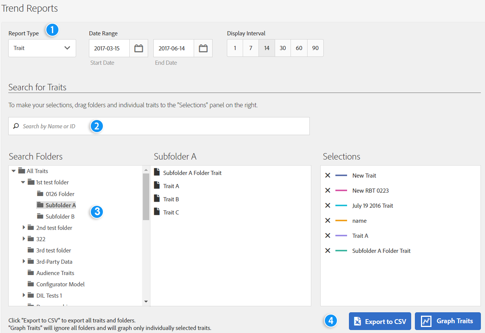
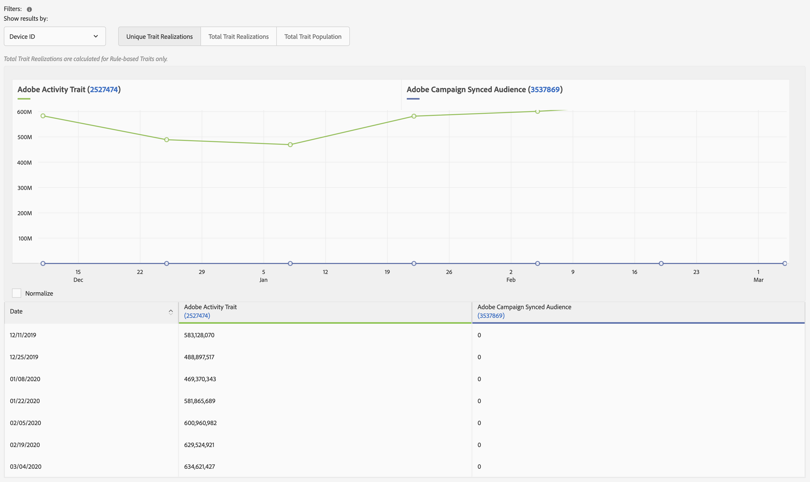
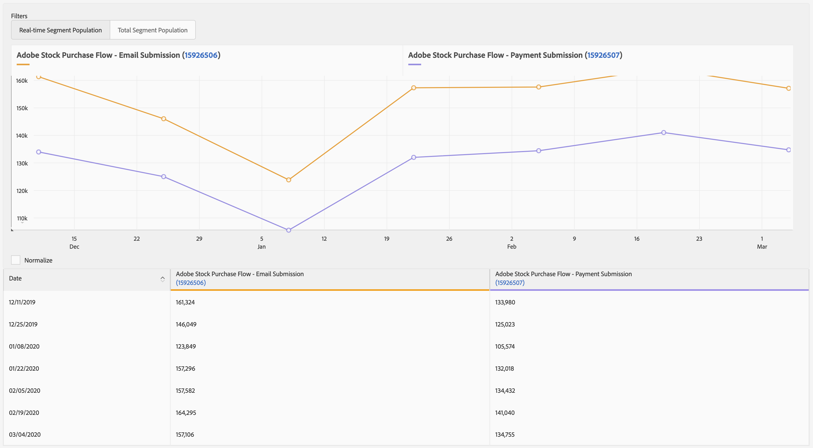

# Trend Reports{#trend-reports}

A Trend report returns trend data on traits and segments.

## Overview {#trend-report-overview}

<!-- 

c_trend_reports.xml

 -->

[!DNL Audience Manager] uses [!UICONTROL Role Based Access Control] ([!UICONTROL RBAC]) to extend user-group permissions to the [!UICONTROL Trend] reports. Users can see only those traits and segments in reporting that they have permissions to view. [!UICONTROL RBAC] functionality lets you control what reporting data internal teams are able to view.

For example, an agency that manages different advertiser accounts can configure user-group permissions so that a team that manages Advertiser A's account cannot see Advertiser B's reporting data.

Run a [!UICONTROL Trend] report when you need to:

* Review trend data by traits and segments.
* Track trends by 1, 7, 14, 30, 60, and 90-day intervals.
* Compare trait and segment trends over time.
* Identify strong or poor performance traits and segments.
* Export data (.csv format) for further analysis and sharing.

The following illustration provides a high-level overview of key elements in the [!UICONTROL Trend] report.

1. Configure the following options:
   **Report Type:** Select the desired report type (Trait or Segment).
   **Date Range:** Specify the date range for the report (start date and end date).
   **Display Interval:** Specify the display interval (1, 7, 14, 30, 60, and 90-day intervals).
1. Search for a trait or segment by name or ID.
1. From the folder list, drag and drop the traits or segments you want to report to the [!UICONTROL Selections] panel on the right side.
1. Generate the report to display in data in graphical format or export the report to CSV format.

## Run a Trend Report {#run-trend-report}

This procedure describes how to run a [!UICONTROL Trend] report.

<!-- 

t_working_with_trend_reports.xml

 -->

1. In the **[!UICONTROL Analytics]** dashboard, click **[!UICONTROL Trend Reports]**.
1. From the **[!UICONTROL Report Type]** drop-down list, select the desired type: **[!UICONTROL Trait]** or **[!UICONTROL Segment]**.
1. Click the date boxes to display a calendar, then select the starting and ending dates for your report.
1. Specify the display interval: by 1, 7, 14, 30, 60, or 90-day.
1. Search for a trait or segment by name or ID.
1. From the folder list, drag and drop the traits or segments you want to report to the [!UICONTROL Selections] panel on the right side.
   * For best performance, run a [!UICONTROL Trend] report on fewer than 20 traits or segments at a time.
1. Click **[!UICONTROL Graph Traits]** or **[!UICONTROL Graph Segments]**, depending on which type of report you are viewing (Traits or Segments). These options ignore all folders and graphs only individually selected traits or segments.

   Or

   Click **[!UICONTROL Export to CSV]** to export the trait or segment data and all folders in CSV format for further analysis and sharing. This exports the [!UICONTROL Unique Trait Realizations], [!UICONTROL Total Trait Realizations], and [!UICONTROL Total Trait Population] for all day ranges.

   >[!NOTE]
   >
   >[!UICONTROL Total Trait Realizations] are calculated for [!UICONTROL Rule-based Traits] only.

1. (Optional) Mouse over individual traits or segments to display the number of visits and the date for each data point. You can click the column headers in the table to sort the results in ascending or descending order.

## Trend Report Results for Traits {#trend-report-results-traits}

The filters below are available when you run a [!UICONTROL Trend Report] and select **[!UICONTROL Trait]** as the report type.

When filtering the results by [!UICONTROL Device ID]:

* [!UICONTROL Unique Trait Realizations] is the number of your anonymous device visitors that have added the trait to their profile within the selected time range.
* [!UICONTROL Total Trait Realization] is the total number of anonymouse trait realizations within the selected time range.
* [!UICONTROL Total Trait Population] is the number of your anonymous device visitors that have this trait on their profile.

When filtering the results by [!UICONTROL Cross-Device ID]:

* [!UICONTROL Unique Trait Realizations] is the number of your authenticated visitors that have added the trait to their profile, within the selected time range.
* [!UICONTROL Total Trait Realization] is the total number of authenticated trait realizations within the selected time range.
* [!UICONTROL Total Trait Population] is the number of your authenticated visitors that have this trait on their profile.

Zeroes indicate that [!DNL Audience Manager] did not collect data for that day. Blank entries indicate that the trait didn't exist.

Watch the video below for a detailed look at how cross-device metrics work.

>[!VIDEO](https://experienceleague.adobe.com/docs/audience-manager-learn/tutorials/build-and-manage-audiences/profile-merge/understanding-cross-device-metrics-in-audience-manager.html)

## Trend Report Results for Segments {#segment-report-results-traits}

The filters below are available when you run a [!UICONTROL Trend Report] and select **[!UICONTROL Segments]** as the report type.

* **[!UICONTROL Real-time Segment Population]**: the number of visitors qualified for the segment within the selected time range.
* **[!UICONTROL Total Segment Population]**: the total number of visitors qualified for the segment.

