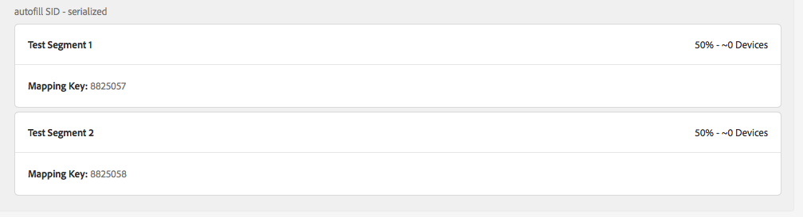
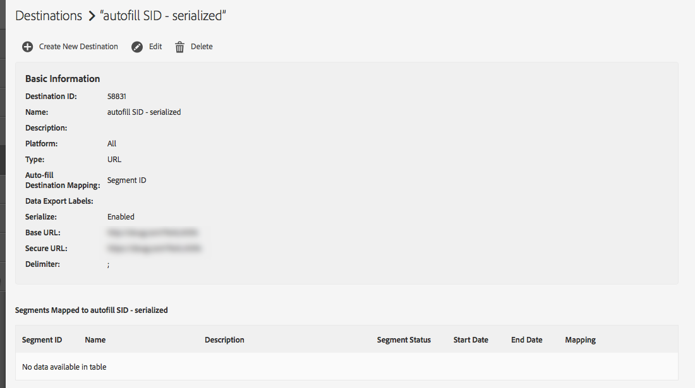

# Should I see my Audience Lab mapped segments on the destination details page? {#audience-lab-segments-destination-page}

## Question

I have some test segments created in [!UICONTROL Audience Lab], and have mapped them to a destination. However, when I look for them on the destination details page, I don't see them.

Is this behavior expected, or is this a bug?

## Answer

Mapped segments that are created within [!UICONTROL Audience Lab] are not displayed on the destination details page.

For example, in the screenshots below, [!UICONTROL Test Segment 1] and [!UICONTROL Test Segment 2] are mapped to the [!UICONTROL autofill SID - serialized] destination.

The segments do show up in the Audience Lab segment test:

The segments will not, however, show up in the destination details page:

