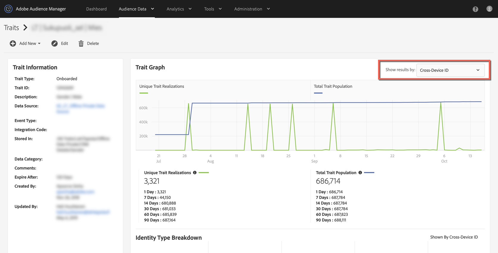

# Why did my Onboarded trait populations drop to 0 around October 15th? {#why-did-my-onboarded-trait-populations-drop-to-0-around-october}

## Question

Around October 14th, 2019 I noticed that my onboarded trait populations for the Device ID graph have dropped to 0, where previously they were much higher. Why did this happen?

## Answer

On October 15th, an update to Audience Manager's Profile Merge Rule functionality was changed to where Onboarded data keyed off of a CRM ID uploaded to a Cross Device Data Source are no longer being realized against device ids.  Previously Audience Manager was realizing against both the Cross Device ID (or CRM ID) as well as copying those realizations to associated Audience Manager UUIDs (Device IDs).  The change was made to more accurately reflect the nature of the trait data and the profiles being realized.

To view the trait realizations, please select "Cross-Device ID" option from the drop down in the top right hand corner of the Trait view.

